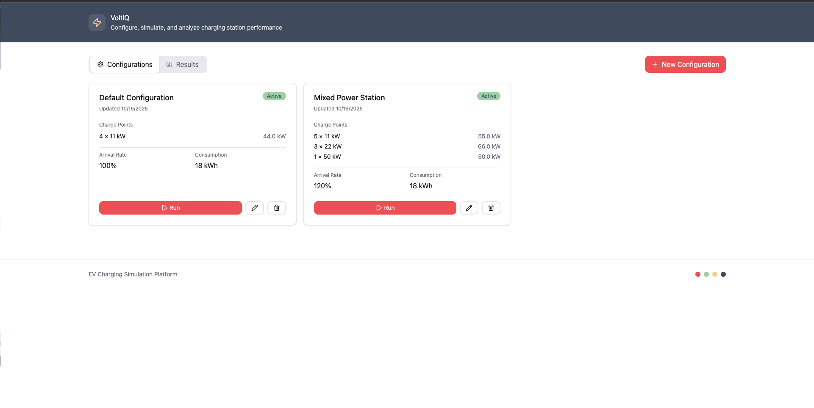
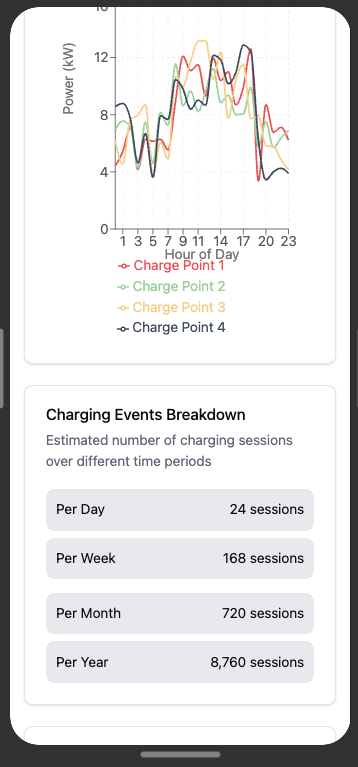

# ⚡ VoltiQ

> A modular toolkit for EV charging calculations, simulation, and energy analytics.

[](https://www.typescriptlang.org/)
[](https://reactjs.org/)
[](https://vitejs.dev/)
[](https://tailwindcss.com/)
[](https://recharts.org/)
[](https://vitest.dev/)

---

## 📋 Table of Contents

- [Overview](#overview)
- [Features](#features)
- [Tech Stack](#tech-stack)
- [Project Structure](#project-structure)
- [Quick Start](#quick-start)
- [Testing](#testing)
- [Task Breakdown](#task-breakdown)
  - [Task 1: Simulation Logic](#task-1-simulation-logic)
  - [Assumptions and Reasoning](#assumptions-and-reasoning)
  - [Task 2a: Frontend UI](#task-2a-frontend-ui)
- [Design Philosophy](#design-philosophy)
- [Screenshots](#screenshots)
- [Running the simulation locally](#running-the-simulation-locally)
- [Author](#author)
- [Acknowledgments](#acknowledgments)

---

## 🎯 Overview {#overview}

This application simulates electric vehicle charging station usage patterns over a full year to help business owners make informed decisions about EV infrastructure investments. By modeling realistic arrival patterns and charging demands, it calculates:

- **Total energy consumption** (kWh/year)
- **Peak power demand** (kW)
- **Concurrency factor** (actual vs. theoretical maximum demand)
- **Charging event patterns** over time

The simulator demonstrates that while 20 chargers at 11kW each have a **theoretical maximum** of 220kW, the **actual peak demand** is typically only 77-121kW due to staggered usage patterns.

Voltiq simulates real-world electric vehicle (EV) charging demand to help businesses estimate:

- Total yearly energy usage
- Actual peak load
- Concurrency factor compared to theoretical maximum

This project implements:

- **Task 1:** EV charging simulation engine (mathematical model)
- **Task 2a:** Interactive UI for configuring and visualizing results

---

## ✨ Features {#features}

### Task 1: Simulation Engine

- **Year-long simulation** : in 15-minute intervals (35,040 data points)
- **Probabilistic modeling** : using real-world arrival and demand distributions
- **Deterministic randomness** : with seeded RNG for reproducible results
- **High-performance** : simulation completes in ~100-200ms

### Task 2a: Interactive UI

- **Mobile-first responsive design** (works on phone, tablet, desktop)
- **Custom components** built from scratch
- **Real-time parameter adjustment** with interactive sliders
- **Data visualization** with power demand and event charts

---

## 🛠️ Tech Stack {#tech-stack}

### Core

- **React 19** - UI framework
- **TypeScript 5** - Type safety and developer experience
- **Vite 7** - Lightning-fast build tool and dev server

### Styling

- **Tailwind CSS 4** - Utility-first CSS framework
- **Custom components** - No pre-built UI libraries

### Data & State

- **Recharts** - Composable charting library
- **date-fns** - Date utilities
- **seedrandom** - Deterministic pseudo-random number generation

### Development & Testing

- **Vitest** - Fast unit test framework
- **Storybook 8** - Component development and documentation
- **ESLint** - Code quality
- **Prettier** - Code formatting

---

## 📁 Project Structure {#project-structure}

```
voltiq/
├── src/
│   ├── simulation/              # Task 1 - Simulation Engine
│   │   ├── core/
│   │   │   ├── engine.ts        # Main EVChargingSimulator class
│   │   │   ├── constants.ts     # Probability distributions (T1, T2)
│   │   │   └── utils.ts         # Helper functions (random sampling, etc.)
│   │   ├── types.ts             # TypeScript interfaces
│   │   └── index.ts             # Public API
│   │
│   ├── components/              # Task 2a - React UI
│   │   ├── atomic/              # Basic building blocks
│   │   │   ├── AlertDialog.tsx
│   │   │   ├── Badge.tsx
│   │   │   ├── Button.tsx
│   │   │   ├── Card.tsx
│   │   │   ├── Input.tsx
│   │   │   ├── Label.tsx
│   │   │   ├── Slider.tsx
│   │   │   ├── Tabs.tsx
│   │   │   ├── Toast.tsx
│   │   │   └── index.ts
│   │   └── voltiq/              # VoltIQ-specific components
│   │       ├── ChargePointTypeManager.tsx
│   │       ├── ConfigurationForm.tsx
│   │       ├── ConfigurationList.tsx
│   │       ├── SimulationResults.tsx
│   │       └── index.ts
│   │
│   ├── types/                   # TypeScript type definitions
│   │   └── simulation.ts        # Simulation-related types
│   │
│   ├── utils/                   # Utility functions
│   │   ├── mockApi.ts           # Mock API for frontend
│   │   └── mockData.ts          # Mock data generation
│   │
│   ├── styles/
│   │   └── globals.css          # Global styles & Tailwind imports
│   │
│   ├── App.tsx                  # Root component with main UI
│   ├── main.tsx                 # Application entry point
│   └── cli.ts                   # Command-line simulation runner
│
├── tests/
│   └── simulation/              # Task 1 unit tests
│       └── engine.test.ts
--- docs/                        # images
|    |----screenshots/
|         |--desktop.png
|         |--mobile.png
|
├── public/                      # Static assets
│   └── vite.svg
├── index.html                   # HTML entry point
├── vite.config.ts               # Vite configuration
├── vitest.config.ts             # Vitest configuration
├── tsconfig.json                # TypeScript configuration
├── tsconfig.app.json            # App-specific TypeScript config
├── tsconfig.node.json           # Node-specific TypeScript config
├── eslint.config.js             # ESLint configuration
└── package.json                 # Dependencies and scripts
```

---

## 🚀 Quick Start - Running Voltiq {#quick-start}

### Prerequisites

- Node.js 18+ and npm 9+

### Installation & Run

```bash
# Clone the repository
git clone <repository-url>
cd voltiq

# Install dependencies
npm install

# Start development server
npm run dev

# Open browser to http://localhost:5173
```

That's it! The application UI should now be running. 🎉

### Running the simulation locally (Optional) {#running-the-simulation-locally}

You can run the simulation engine directly from the command line to test different configurations:

```bash
# Run with default configuration (20 chargers, 11kW, 100% arrival rate)
npm run simulate

# Run with custom parameters
npm run simulate numChargers=10 chargerPowerKW=22 arrivalMultiplier=150

# Run with different car efficiency
npm run simulate carEfficiencyKWhPer100Km=20

# Combine multiple parameters
npm run simulate numChargers=15 chargerPowerKW=50 arrivalMultiplier=120 carEfficiencyKWhPer100Km=16
```

**Available parameters:**

- `numChargers` - Number of charge points (1-30)
- `chargerPowerKW` - Power per charger in kW (3.7-350)
- `arrivalMultiplier` - Arrival rate multiplier (0.2-2.0)
- `carEfficiencyKWhPer100Km` - Car efficiency (10-30 kWh/100km)
- `seed` - Random seed for reproducible results (optional)

---

## 🧪 Testing {#testing}

### Running Tests

```bash
# Run all tests
npm test

# Run with coverage
npm run test:coverage

# Run specific test file
npm test engine.test.ts

```

### Test Coverage

- ✅ Simulation accuracy (validates against expected ranges)
- ✅ Probability distribution sampling
- ✅ Edge cases (zero arrivals, max capacity, fractional ticks)
- ✅ Deterministic behavior (seeded RNG)
- ✅ Performance benchmarks

## 📚 Task Breakdown {#task-breakdown}

### ✅ Task 1: Simulation Logic {#task-1-simulation-logic}

**Location**: `src/simulation/`

## 🔬 Assumptions and Reasoning {#assumptions-and-reasoning}

### Critical Interpretation: Arrival Probabilities

**The Challenge**
The task provides arrival probabilities (e.g., 10.38% during 4-7 PM) but doesn't explicitly state whether this represents:
- Option A: Probability of any arrival at the entire site per hour
- Option B: Probability of arrival per charger per hour

**My Interpretation: Per-Charger Probabilities**
After initial implementation and calibration, I interpreted these as per-charger, per-hour probabilities. Here's why:

- **Scalability Logic**: If probabilities were site-wide, adding more chargers wouldn't increase utilization proportionally - which doesn't match real-world behavior. In reality, more parking spaces → more potential customers.
- **Target Metrics Alignment**: Using per-charger interpretation with the given probabilities yields results in the expected range:
  - Actual max power: 77-121 kW ✓
  - Concurrency factor: 35-55% ✓
- **Real-World Analogy**: Each parking space has its own independent chance of being occupied, similar to how each checkout lane in a store has its own customer arrival rate.

**Implementation Details**
For each 15-minute tick:
```
adjustedProbability = (hourlyProbability / 4) * arrivalMultiplier
```
- **Division by 4**: Converts hourly probability to per-tick (15-min) probability
- **Arrival multiplier**: Allows simulating busier/quieter scenarios (default: 1.0)

Each charger independently checks for arrivals every tick, creating realistic concurrent usage patterns.

### Assumption: Charging Demand Distribution

**Interpretation of "None" Category**
The charging demand table shows 34.31% as "None (doesn't charge)". I interpret this as:
- EV arrives at the location
- Driver parks but decides not to plug in (already has enough charge, just stopping briefly, etc.)
- Charger remains available for next arrival

**Why this matters**: These non-charging arrivals don't block chargers, allowing realistic turnover rates.

**Energy Calculation**
For charging sessions:
```
energyNeeded (kWh) = (distanceKm / 100) × carEfficiency (kWh/100km)
```
Default: 18 kWh/100km (typical for modern EVs like Tesla Model 3, VW ID.4)

### Assumption: Charging Duration & Departure

**Duration Calculation**
```
chargingTime (hours) = energyNeeded / chargerPower
durationTicks = ceil(chargingTime × 4)
```
**Key decision**: Round up to ensure full energy delivery. A car needing 10.2 kWh will occupy the charger for 3 ticks (45 min) rather than leaving partially charged.

**Immediate Departure**
Assumption: EVs depart immediately upon charging completion.
**Rationale**:
- Simplifies simulation (no idle/overstay time)
- Represents ideal scenario (e.g., parking enforcement, time limits, or courteous drivers)
- Maximizes charger availability

*Real-world consideration*: In practice, some drivers overstay. This could be modeled with an additional "dwell time" parameter in future iterations.

### Assumption: Charger Availability Logic

**Blocking Mechanism**
A charger is blocked from tick t through tick t + duration - 1.
**Example**:
- Car arrives at tick 100, needs 4 ticks of charging
- Charger occupied: ticks 100, 101, 102, 103
- Charger available again: tick 104

**Arrivals at Occupied Chargers**
If an arrival is generated for an occupied charger, that arrival is lost (car finds parking elsewhere or leaves).
**Why not queue?** The task describes physical parking spaces with chargers - there's nowhere to queue. This matches real-world behavior at destination charging locations.

### Assumption: Power Demand Calculation

**Instantaneous Power**
During each tick, power demand is calculated as:
```
totalPower = count(occupiedChargers) × chargerPower
```
**Simplification**: Assumes constant power delivery throughout the charging session (no tapering at high SOC, no power ramping).

**Energy Accounting**
Energy consumed per tick accounts for partial final ticks:
- Most ticks: `chargerPower × 0.25 hours` (full 15-min interval)
- Final tick: May be fractional if charging completes mid-interval

This ensures total energy consumed exactly matches sum of all session demands.

### Assumption: Temporal Distribution

**No Daylight Saving Time (Default)**
By default, the simulation uses a simple tick-to-hour mapping:
```
hour = floor((tick % 96) / 4)
```
**Rationale**:
- Simplifies implementation
- DST shifts affect arrival patterns by ±1 hour twice per year - minimal impact on annual metrics
- Optional `useDST` parameter available for future enhancement

**Uniform 15-Minute Intervals**
All arrivals, departures, and measurements happen on 15-minute boundaries.
**Trade-off**:
- ✓ Computationally efficient (35,040 ticks vs. continuous simulation)
- ✓ Matches typical smart meter resolution
- ✗ Can't capture sub-15-minute dynamics

### Assumption: Stochastic Behavior

**Seeded Randomness**
The simulation uses seedable pseudo-random number generation for:
- ✓ Reproducible results (same seed → identical output)
- ✓ Debugging and testing
- ✓ Consistent comparisons across parameter variations

**Independent Events**
Each charger's arrival probability is evaluated independently every tick. This means:
- Multiple arrivals can happen simultaneously at different chargers
- No artificial smoothing or correlation between chargers
- Produces realistic "clumpy" behavior (sometimes many cars, sometimes none)

### ✅ Task 2a: Frontend UI {#task-2a-frontend-ui}

**Location**: `src/components/`

## 🎨 Design Philosophy {#design-philosophy}

### Simplicity & Clarity

- Clean, uncluttered interface
- Clear visual hierarchy
- Intuitive controls

### Performance

- Optimized rendering (debounced updates)
- Fast simulation (< 200ms for full year)

### Accessibility

- Semantic HTML
- ARIA labels
- Keyboard navigation
- Sufficient color contrast

### Code Quality

- Strong TypeScript typing
- Modular component architecture
- Comprehensive test coverage
- Self-documenting code

---

## 📸 Screenshots {#screenshots}

### Desktop View



### Mobile View



---

## 👤 Author {#author}

**Samuel** - Junior Mobile Engineer Applicant  
(Technical Assessment for Reonic GmbH)

---

## 🙏 Acknowledgments {#acknowledgments}

- Reonic team for the interesting problem statement
- The React and TypeScript communities for excellent tooling
- Open-source maintainers of all dependencies used
